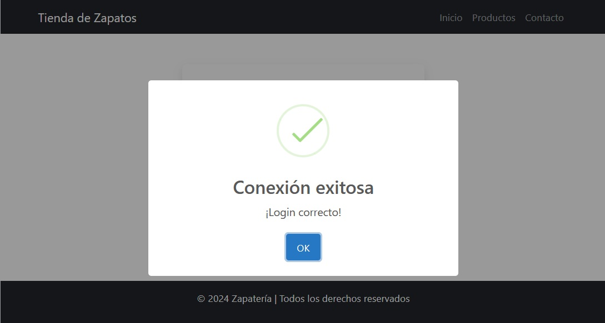

# Sistema de Gestión de Productos y Usuarios

## Descripción del Proyecto
Este proyecto es un sistema de gestión de productos y usuarios desarrollado con **Node.js** y **Express**. Solo los usuarios autenticados pueden acceder y realizar modificaciones en los productos. La base de datos utilizada es **MySQL** y las contraseñas están cifradas con **bcrypt**.

## Funcionalidades
- CRUD de productos y usuarios.
- Autenticación de usuarios.
- Gestión de usuarios logueados.
- Seguridad mediante cifrado de contraseñas.
- Rutas protegidas.
  
## Capturas de Pantalla

### Página Principal:

### Listado de Productos:

### Crear Producto:

### Editar Producto:

### Listado de Usuarios:

### Inicio de Sesión:

### Inicio exitoso:

### Registro de Usuarios:

## Tecnologías Utilizadas
- Node.js
- Express
- MySQL
- Bootstrap
- bcrypt

